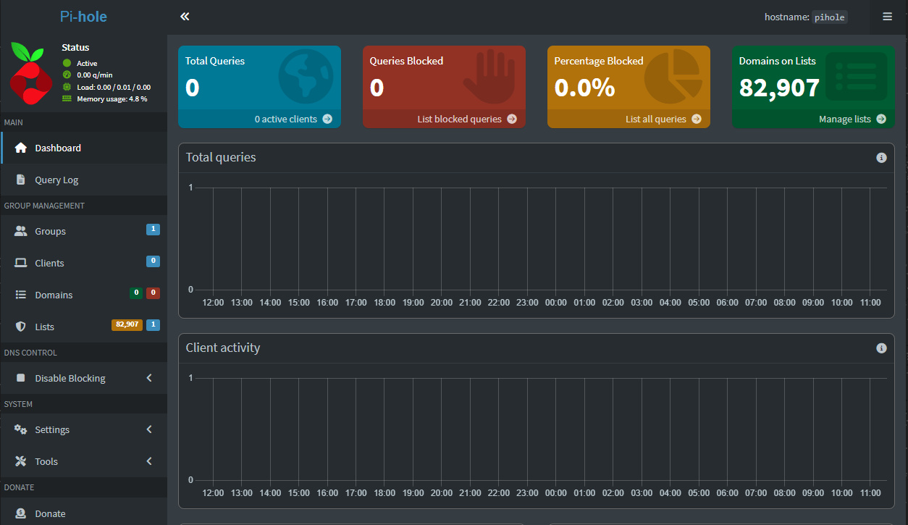
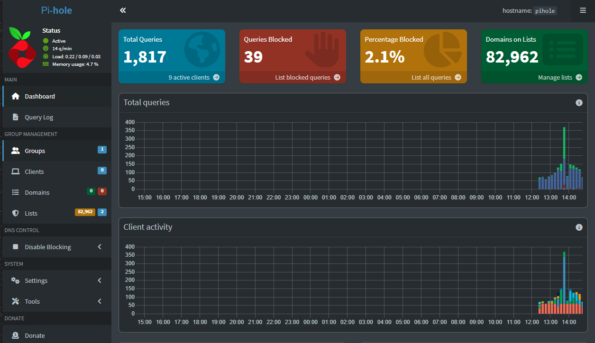

# Pi-hole Setup

This document describes how to deploy and configure Pi-hole on a Raspberry Pi using Docker Compose for network-wide ad blocking.

## Requirements

- Raspberry Pi with Raspberry Pi OS
- Docker and Docker Compose installed
- Static IP configured for Raspberry Pi
- Optional: devices to test Pi-hole (PC, phone, TV)

## Deployment
- Deployed using Docker Compose
- Exposed ports:
  - 53 (DNS)
  - 80 (Web UI)

## Setting the Admin Password
- After first container start, default password is auto-generated and cannot be retrieved
- Set a new password interactively inside the container:
### Bash:
- docker exec -it pihole /bin/bash
- pihole -a -p
- exit

## Optionally, to disable password:
### Bash:
- docker exec -it pihole /bin/bash
- pihole -a -p ""
- exit

## Verification
Web interface is accessible via http://<raspberrypi_IP>/admin
- can log in using newly set password

## Pi-Hole Dashboard (Before Troubleshooting)

## Test DNS Blocking
**nslookup doubleclick.net <raspberrypi_IP>**
- Should return 0.0.0.0 if Pi-hole is working

## Network Integration

Pi-hole was integrated at the router level to enable network-wide ad blocking.

- Router DHCP server configured to advertise Pi-hole as the **primary DNS server**
- Pi-hole assigned a **static IP address**: "192.168.x.xx"
- Secondary DNS servers removed to prevent DNS bypass
- Devices automatically receive Pi-hole DNS via DHCP

Manual DNS configuration was used on selected devices during testing.

## Troubleshooting Notes
As you can see on the image above, Pi-hole was working, but not blocking. If that happens, make sure:
- Devices use Pi-hole IP as primary DNS
- Randomized MAC addresses are disabled (specifically on phones)
- Flush DNS cache after changing settings
- IPv6 may bypass Pi-hole; configure Pi-hole IPv6 or disable on devices if needed (specifically on PC)

**Root cause:**
- Devices were using secondary DNS servers (1.1.1.1 / 8.8.8.8)
- IPv6 DNS was bypassing Pi-hole
- Randomized MAC addresses caused devices not to appear in DHCP leases

## Pi-Hole Dashboard (After Troubleshooting)

